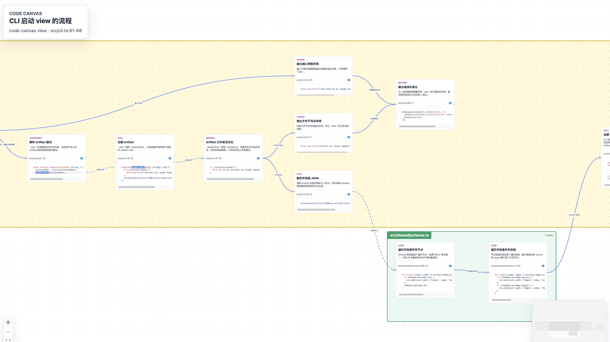

# Code Canvas

[简体中文](README.zh-CN.md)

Code Canvas converts code control flow and call relationships into interactive flowcharts, helping developers quickly understand functions, components, hooks, event handlers, and cross-file call chains.

The project includes:

- `@haydenull/code-canvas`: Validates `.logic.json` artifacts and displays nodes, branches, call relationships, module groups, and source code snippets in a Web Viewer.
- `code-canvas-generator` Skill: Enables coding assistants that support Agent Skills to read real source code and generate flowchart artifacts for Code Canvas.

## Preview



## Install CLI

Install the CLI globally:

```bash
npm install -g @haydenull/code-canvas@latest
```

Use `code-canvas stop` to stop the viewer when you're done.

## Install Skill

The `code-canvas-generator` Skill is located in the [`skills/code-canvas-generator`](skills/code-canvas-generator/SKILL.md) directory.

Install via `npx skills`:

```bash
npx skills add haydenull/code-canvas --skill code-canvas-generator
```

Or install using [haydenull/skills-manager](https://github.com/haydenull/skills-manager).


## Docs

- [Development Guide](docs/development.md)
- [Publishing to npm](docs/publishing.md)
